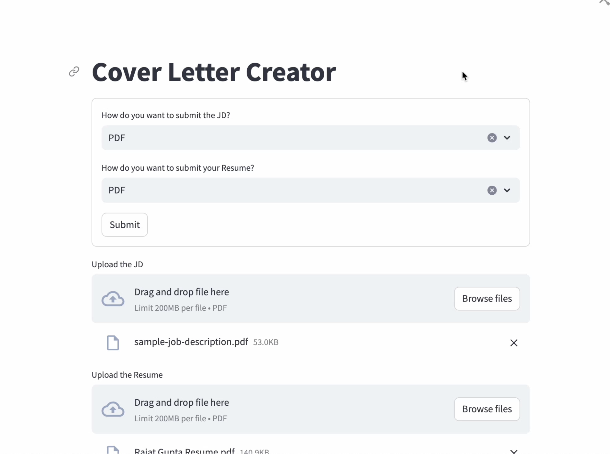
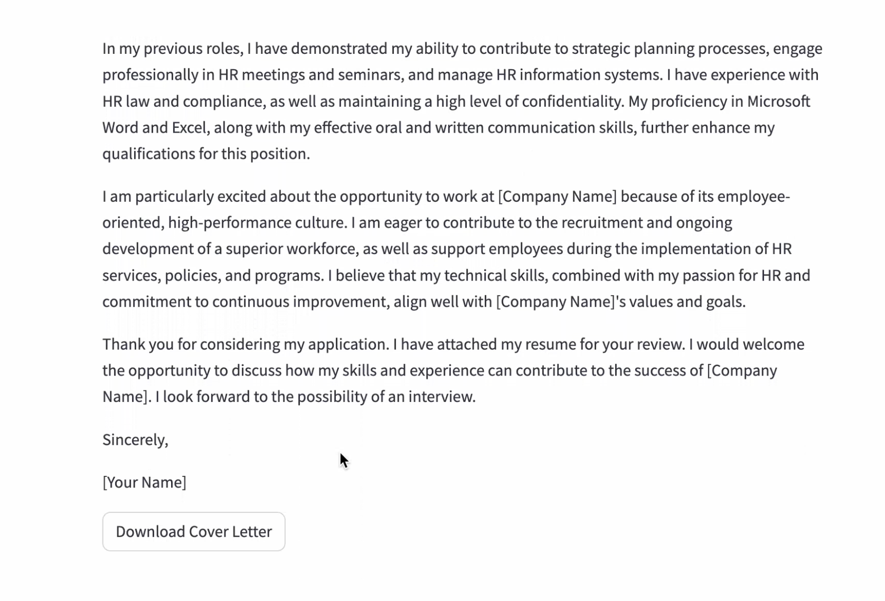

# Cover Letter Creator

The project creates a customized cover letter based on the job description and the resume provided.

## Requirements

The only requirement is to have an OpenAI Account, the key for which has to be set as an environment variable in the .env file  
Use the command "streamlit run CoverLetterCreator.py" on terminal to run the UI for streamlit  

## Demo

The video - Demo.mp4 gives a detailed demo of the code and the user interface  

The streamlit provides a great platform for creating a UI for running the code. The image below shows a snapshot of uploading the JD and the resume:  

The second image shows a sample cover letter and the link to download the letter.  

Demo Video
