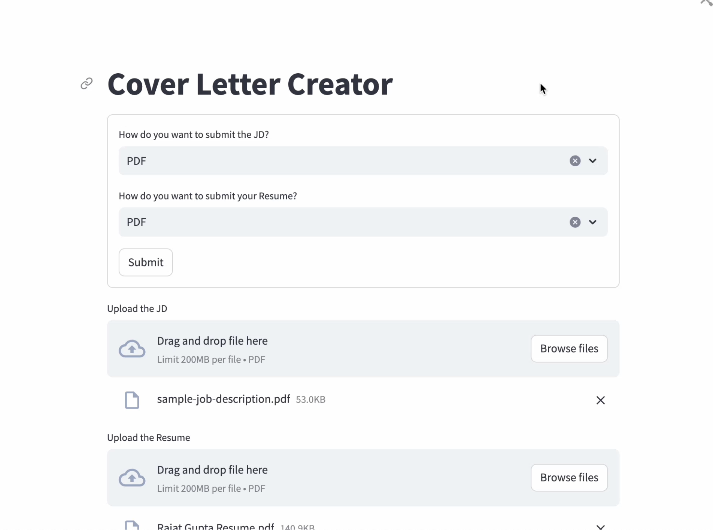
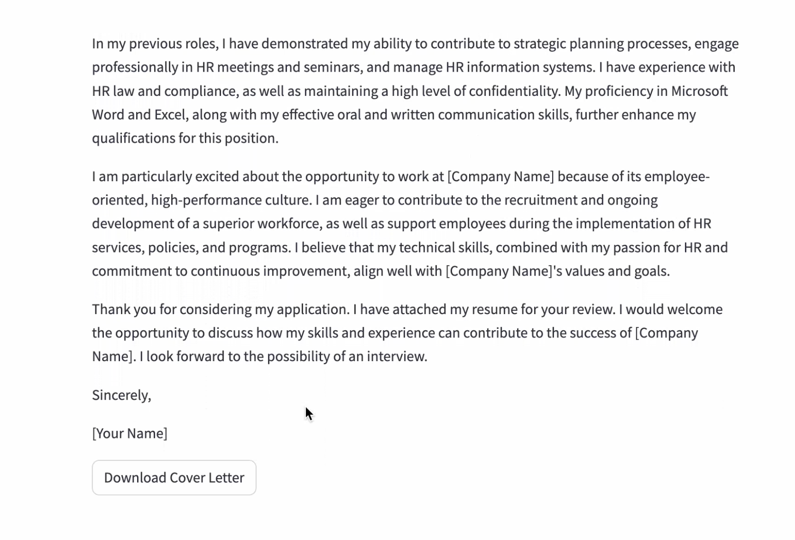

# Cover Letter Creator

The project creates a customized cover letter based on the job description and the resume provided.

## Requirements

The only requirement is to have an OpenAI Account, the key for which has to be set as an environment variable in the .env file

## Demo

The video - Demo.mp4 gives a detailed demo of the code  

The streamlit creates a great interface for creating a UI for running the code. The images below show a snapshot of the same:  

